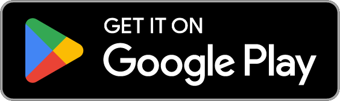
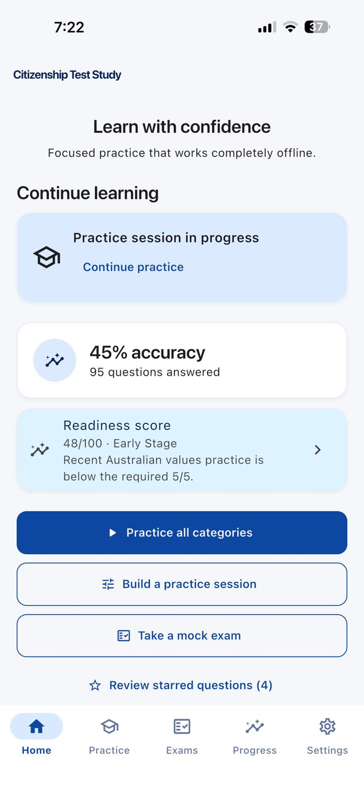
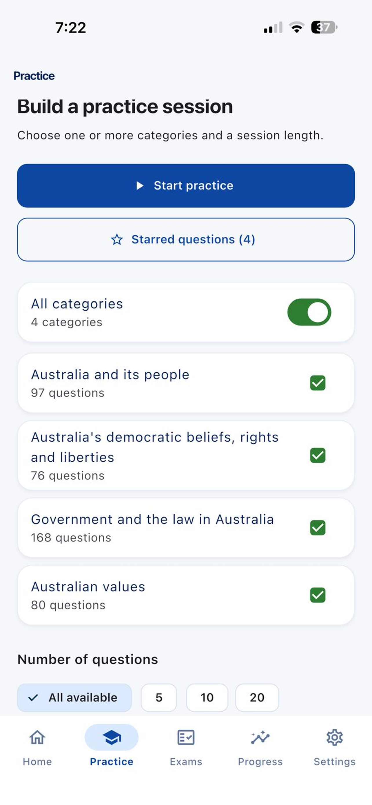
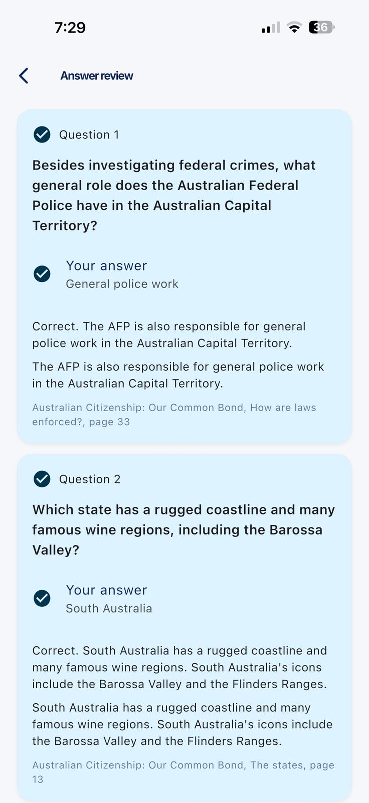
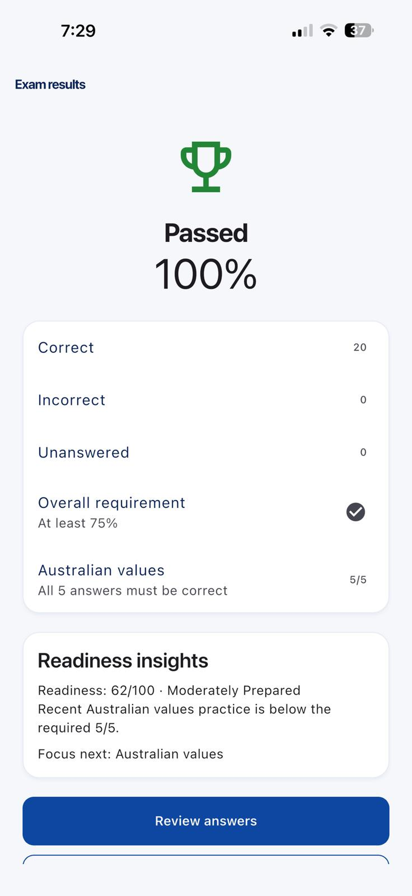

# Pass Australian Citizenship Test

Study for the real Australian Citizenship Test — free, offline, and without the ads or clutter that plague most test-prep apps.

  
  

## Demo

  
  
  
  

## Why this app

Most citizenship test apps are ad-ridden, out of date, or push you to memorize answers instead of understanding them. This one is built to actually get you ready:

- **421 practice questions** covering all four official test categories: Australia and its people, Australia's democratic beliefs, government and the law, and Australian values.
- **Instant feedback with explanations** — every answer comes with a source reference, not just a checkmark.
- **Realistic mock exams** that mirror the real test, including the requirement to answer every Australian values question correctly to pass.
- **Fully offline** once installed — study on the train, on a plane, anywhere.
- **Free**, with no ads, no subscriptions, and no in-app purchases.
- **No account, no data collection** — nothing is gathered, transmitted, or sold.

## How to use it

1. **Practice** — work through all questions or focus on a single category (or a few) with your choice of session length. Get an explanation and source reference for every answer as you go.
2. **Star tricky questions** to build a personal revision list.
3. **Take a mock exam** — an untimed, resumable simulation of the real test with scoring and full answer review at the end.
4. **Track your progress** — review your exam history and see which categories need more work before test day.

## Status

Version 1.0.0 is live on both platforms — Android since 2026-08-13, iOS since 2026-08-18. See `CHANGELOG.md` for release notes and `BACKLOG.md` for what's next.
